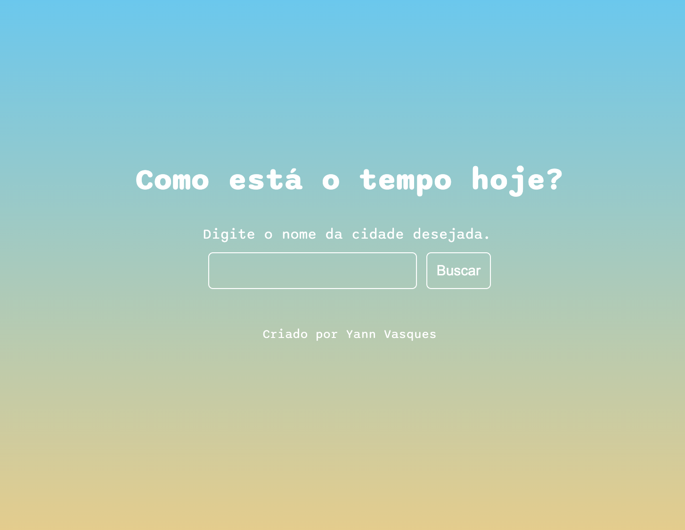

# Consulta de Previsão do Tempo

Este é um projeto simples de consulta de previsão do tempo, onde o usuário pode digitar o nome de uma cidade para obter informações sobre temperatura e velocidade do vento.

## Tecnologias Utilizadas
- HTML5
- CSS3
- JavaScript
- OpenWeather API

## Propósito do Projeto
Este projeto foi utilizado como exercício para o uso de APIs, JSON e manipulação de HTML pelo JavaScript. Foi desenvolvido com suporte do curso da B7web.

## Como Utilizar
Este projeto pode ser acessado através de: https://yvasques.github.io/previsao_tempo/

## API Utilizada
Este projeto utiliza a [OpenWeather API](https://openweathermap.org/) para obter os dados meteorológicos.
